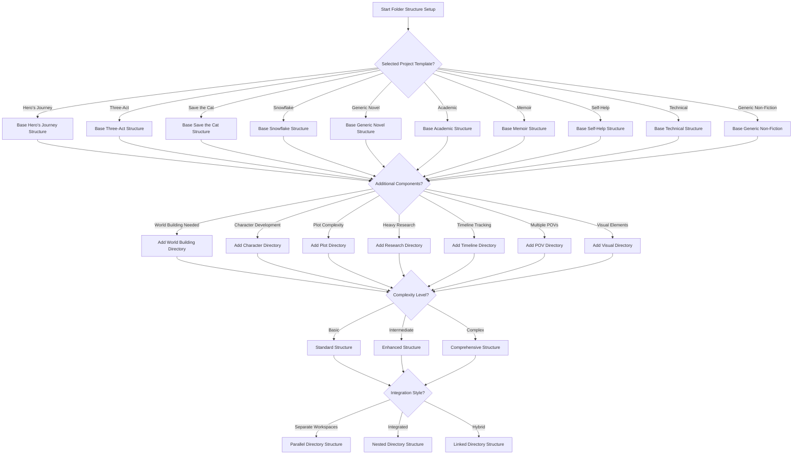

# Folder Structure Adaptation Decision Tree

## Folder Structure Adaptation Factors

### Base Template Selection
- Each project type starts with a predefined base folder structure
- Base structures align with specific writing methodologies
- All base structures include core components (manuscript, notes, etc.)

### Additional Component Factors
- **World Building**: For projects with complex settings or fictional worlds
  - Basic: Single folder for world notes
  - Intermediate: Categorized world elements (locations, cultures, etc.)
  - Complex: Hierarchical world database with cross-references

- **Character Development**: For character-driven narratives
  - Basic: Character profiles
  - Intermediate: Character arcs and relationship charts
  - Complex: Psychological profiles, evolution maps, connection networks

- **Plot Complexity**: For intricate or multi-layered plots
  - Basic: Plot point outlines
  - Intermediate: Scene-by-scene breakdowns
  - Complex: Multi-thread tracking system with cross-plot dependencies

- **Research Components**: For research-heavy projects
  - Basic: General research notes
  - Intermediate: Categorized research by topic
  - Complex: Annotated reference system with citation links

- **Timeline Tracking**: For non-linear or complex chronologies
  - Basic: Simple timeline
  - Intermediate: Parallel timeline tracking
  - Complex: Interactive timeline with event dependencies

- **Multiple POVs**: For stories with multiple perspectives
  - Basic: POV character list
  - Intermediate: POV-specific plot tracking
  - Complex: POV intersection mapping

- **Visual Elements**: For projects with visual components
  - Basic: Reference images folder
  - Intermediate: Categorized visual references
  - Complex: Storyboarding system

### Integration Methods
- **Parallel Structure**: Independent directories with minimal cross-referencing
- **Nested Structure**: Hierarchical organization with components as subdirectories
- **Linked Structure**: Independent directories with explicit cross-reference system

## Implementation Notes
- All folder structures include README files explaining purpose and organization
- Adaptation logic includes creation of templates for documents within each component
- Each folder structure is generated with example files to demonstrate usage 