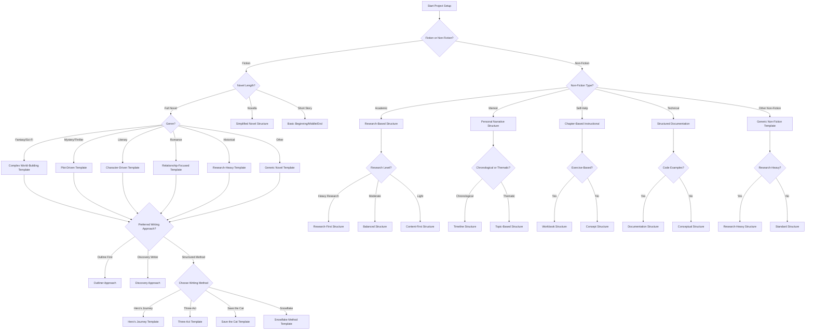

# Project Type Selection Decision Tree

## Decision Points and Outcomes

### Initial Project Type
- **Fiction vs Non-Fiction**: Determines the primary branch of the decision tree
- **Novel Length**: For fiction, determines complexity of structure needed
- **Non-Fiction Type**: For non-fiction, determines specialized structure

### Fiction Specifics
- **Genre Selection**: Determines specialized templates with focus on relevant elements
- **Writing Approach**: Determines organization of project files and workflow
  - **Outline First**: Heavily structured with detailed planning documents
  - **Discovery Writer**: Minimal structure with focus on draft folders
  - **Structured Method**: Follows specific writing methodology

### Non-Fiction Specifics
- **Research Level**: Determines balance between research and content files
- **Organization Approach**: Determines how content is structured (chronological/thematic/etc.)
- **Format Requirements**: Determines specialized templates for workbooks, technical docs, etc.

## Output
Each endpoint in this decision tree will map to a specific template configuration combining:
1. Folder structure
2. Document templates
3. Writing guidance
4. Research organization
5. Reference materials 