# Structure Recommendation Decision Tree

```mermaid
flowchart TD
    A[Start Structure Selection] --> B{Fiction or Non-Fiction?}
    
    %% Fiction Branch
    B -->|Fiction| C{Experience Level?}
    C -->|Beginner| D{Genre?}
    C -->|Intermediate| E{Genre?}
    C -->|Advanced| F{Genre?}
    
    %% Beginner Fiction Recommendations
    D -->|Fantasy/Sci-Fi| G[Three-Act Structure]
    D -->|Mystery/Thriller| H[Save the Cat]
    D -->|Literary| I[Classic Three-Act]
    D -->|Romance| J[Save the Cat]
    D -->|Historical| K[Three-Act Structure]
    D -->|Other| L[Three-Act Structure]
    
    %% Intermediate Fiction Recommendations
    E -->|Fantasy/Sci-Fi| M[Hero's Journey]
    E -->|Mystery/Thriller| N[Save the Cat]
    E -->|Literary| O[Character-Driven Approach]
    E -->|Romance| P[Save the Cat with Relationship Beats]
    E -->|Historical| Q[Three-Act with Research Framework]
    E -->|Other| R[Choose Method Based on Complexity]
    
    %% Advanced Fiction Recommendations
    F -->|Fantasy/Sci-Fi| S[Hybrid Hero's Journey/Snowflake]
    F -->|Mystery/Thriller| T[Complex Plot Mapping]
    F -->|Literary| U[Character-Driven Framework]
    F -->|Romance| V[Custom Beat Sheets]
    F -->|Historical| W[Research-Integrated Framework]
    F -->|Other| X[Custom Framework]
    
    %% Complexity Assessment for Intermediate "Other"
    R --> Y{Story Complexity?}
    Y -->|Complex World| Z[Snowflake Method]
    Y -->|Complex Plot| AA[Save the Cat]
    Y -->|Complex Characters| AB[Character-First Framework]
    Y -->|Standard| AC[Three-Act Structure]
    
    %% Non-Fiction Branch
    B -->|Non-Fiction| AD{Complexity Level?}
    
    AD -->|Simple| AE{Purpose?}
    AD -->|Moderate| AF{Purpose?}
    AD -->|Complex| AG{Purpose?}
    
    %% Simple Non-Fiction
    AE -->|Informational| AH[Sequential Chapters]
    AE -->|Instructional| AI[Step-by-Step Structure]
    AE -->|Persuasive| AJ[Argument-Based Structure]
    AE -->|Narrative| AK[Chronological Structure]
    
    %% Moderate Non-Fiction
    AF -->|Informational| AL[Topic-Based Structure]
    AF -->|Instructional| AM[Hierarchical Framework]
    AF -->|Persuasive| AN[Problem-Solution Framework]
    AF -->|Narrative| AO[Thematic Structure]
    
    %% Complex Non-Fiction
    AG -->|Informational| AP[Comprehensive Framework]
    AG -->|Instructional| AQ[Module-Based Structure]
    AG -->|Persuasive| AR[Multi-Layer Argument Structure]
    AG -->|Narrative| AS[Hybrid Chronological-Thematic]
```

## Structure Selection Factors

### Fiction Structure Criteria
- **Experience Level**: Determines complexity of recommended framework
  - **Beginner**: More straightforward, prescriptive structures
  - **Intermediate**: More flexible with some customization
  - **Advanced**: Highly customizable, complex frameworks
  
- **Genre Considerations**: Each genre has specific structural needs
  - **Fantasy/Sci-Fi**: Focus on worldbuilding, often benefits from Hero's Journey
  - **Mystery/Thriller**: Plot-focused with specific beat requirements
  - **Literary**: Character development is prioritized
  - **Romance**: Relationship development follows specific patterns
  - **Historical**: Requires integration of research with narrative

### Non-Fiction Structure Criteria
- **Complexity Level**: Scale of the project and depth of information
  - **Simple**: Straightforward organization with minimal subdivisions
  - **Moderate**: More developed organization with clear hierarchies
  - **Complex**: Extensive hierarchical organization with multiple layers
  
- **Purpose Considerations**: Different aims require different frameworks
  - **Informational**: Organized to present facts clearly
  - **Instructional**: Structured to guide learning process
  - **Persuasive**: Organized to build a compelling argument
  - **Narrative**: Structured to tell a cohesive story

## Implementation Notes
- Each terminal node maps to a predefined structure template
- Structure templates include recommended chapter organization, section breakdowns, and document templates
- Writers can customize the recommended structure based on specific project needs 